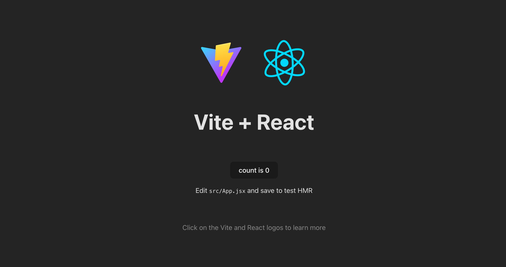
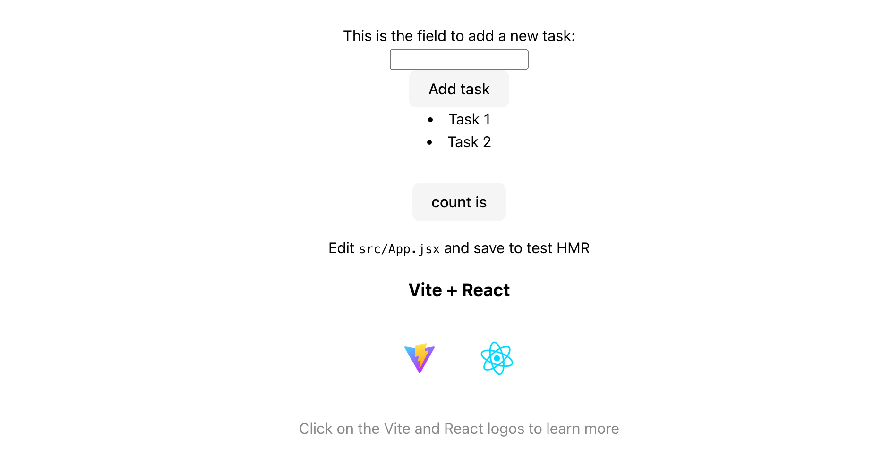

# To-do-list-React-Vite
Trying React-Vite by doing a To do list

# react-todo-list con vite

Exercise here: 
[text](https://github.com/TheBridge-FullStackDeveloper/temario_fullstack_FT_feb24_MAD/blob/main/teoria/react/clase27.md)

## 1. Quick start

1.1. Creamos un repositorio nuevo vacío remoto, y lo clonamos en local. Tenemos node ya instalado en modo global en nuestro equipo.

1.2. Execute: 

```
npm create vite@latest
```

```
➜  To-do-list-React-Vite git:(main) npm create vite@latest
✔ Project name: … todolist
✔ Select a framework: › React
✔ Select a variant: › JavaScript

Scaffolding project in /Users/nana/ENTREGAS/To-do-list-React-Vite/todolist...

Done. Now run:

  cd todolist
  npm install
  npm run dev
```
Then follow the console instrucctions. ¡¡¡ Pay attemtion: if you name the Vite project as your repository you could forget to execute the first command: "cd viteprojectname". Be sure you do it.

1.2. Execute cd + your project name: 
```cd todolist``

1.3. Execute: 
```npm i````

1.4. Execute: 
```npm run dev```

Just now, by clicking on the link showed by the console, you can be your project working into the browser.



Install NPM UUID to manage the keys of the list.

```
npm i uuid
```
We will also install this extension to see the components on the browser: 

React Developer Tools
5.1.0 (4/15/2024)


1. 
a. Create file FormInputTask.jsx. Its content: 

```
// rfce
import React from 'react'

import { useState } from 'react'

function FormInputTask ()  {
    const [task, setTask] = useState('')
    return (
        <form>
        <label>This is the field to add a new task:</label>
        <div><input type="text" /></div>
        <div><button onClick={() => setTask((task) => task)}> Add task {task} </button></div>
    </form>
    )
}

export default FormInputTask
```
B. Into App.jsx: 

At the begining: 
```
import FormInputTask from './FormInputTask'
```
- after return <> wherever you want.

```
 <FormInputTask></FormInputTask>

```

This is the complete code: 

```
import { useState } from 'react'
import reactLogo from './assets/react.svg'
import viteLogo from '/vite.svg'
import './App.css'
import './FormInputTask'
import FormInputTask from './FormInputTask'

function App() {
  const [count, setCount] = useState('')

  return (
    <>
      
      <h1>To Do List Exercise</h1>
     
      <FormInputTask></FormInputTask>

      

      <div className="card">
        <button onClick={() => setCount((count) => count + 1)}>
          count is {count}
        </button>
        <p>
          Edit <code>src/App.jsx</code> and save to test HMR
        </p>

        <h3>Vite + React</h3>
      <div>
        <a href="https://vitejs.dev" target="_blank">
          
        </a>
        <a href="https://react.dev" target="_blank">
          
        </a>
      </div>
      
      <p className="read-the-docs">
        Click on the Vite and React logos to learn more
      </p>
      </div>
    </>
   
  )
}

export default App

```
##2nd POINT: Un componente List que recorra listas de items


Create List.jsx file. This is the content of List.jsx

This is the syntax without mapping: 

```
function List() {
 
    return <section>
        <p>Here goes an item list</p>
        <ul>
        <Item name="Task name">
        </ul>
    </section>  
    
}
```
Incluir la lista en el componente FormInputTask.jsx

```
function FormInputTask ()  {
    const [task, setTask] = useState('')
    return (
        <form>
        <label>This is the field to add a new task:</label>
        <div><input type="text" /></div>
        <div><button onClick={() => setTask((task) => task)}> Add task {task} </button></div>
        <List></List>
    </form>
    )
}
```
Esta sería la sintaxis en List.jsx modificada para que haga un mapeo que dibuje una lista de items. 
```
import React from 'react'
import Item from './Item';

const names = [
    {name:"Task 1"},
    {name:"Task 2"}
]

function List() {
 
    return <section>
        <p>Here goes an item list</p>
        <ul>
        {names.map((item,index) => <Item key={index} name={item.name}/>)}
        </ul>
    </section>  
    
}

export default List
```

##3rd Step: Un componente Item o Card que contenga cada TO-DO

Create Item.jsx file. This is the content: 

```
import React from "react";

function Item(props) {
    return (
        <li>
          {props.name}
        </li>
    );
}

export default Item;
```

Now, up to the return in the List syntax you add a function that paints the resul of the mapping function. The functiion has its own return. The List.jsx file looks so: 

```
import React from 'react'
import Item from './Item';

const names = [
    {name:"Task 1"},
    {name:"Task 2"}
]

function List() {
 
    // Painting mapped items

    const paintItems = () => {
        return names.map((item,index) => <Item key={index} name={item.name}/>)
    }

    return <section>
    {paintItems()}
    </section>  
    
}

export default List
```
And later put the map function into the paint function. Delete the first return and clean the function List() code. The code shows like that:

```
function List() {
 
    // Painting mapped items

    const paintItems = () => names.map((item,index) => 
                                        <Item key={index} name={item.name}/>);
    
    return <section>
        {paintItems()}
    </section>  
};
```

All the code (List.jsx): 

```
import React from 'react'
import Item from './Item';

const names = [
    {name:"Task 1"},
    {name:"Task 2"}
]

function List() {
 
    // Painting mapped items

    const paintItems = () => names.map((item,index) => 
                                        <Item key={index} name={item.name}/>);
    
    return <section>

        {paintItems()}
        
    </section>  
};

export default List
```

It looks like that on the browser (I changed some styles): 



##4rd Step: Botón CLEAR para borrar todas las tareas

Fot these task we will use useState. An state is a litle memory space that the component has to save information.

We will save Item data in a state. It would be, for example, a card or a table, or an image, or whatever you want.

By these, we will be able to write items (saving data from an input type text), add, or delete using this memory, changing the state, puting, deleting or posting information into it. Also a counter or the kind component information you want to manage. It is also for saving user interaction and later do something with that information.

We will use what is called state hook.

A hook is an auxiliar function to do something in react, a react auxiliar function. 

This is the standard syntax for useState Hook (where you see brackets = destructuring)

```
const [variable (or state), methodName(method_to_change_the_variable,the state, i.e. setValue)] = useState(intial_value_of_state);
```
useState return an array with two things: One is the variable (state) and the other the method to change this variable (this state).

EACH TIME THE STATE CHANGE BY AN INTERACTION THE VIRTUAL DOM REFRESH.

Later, we will use these: 

```
const handleAddClick = () => {
  methodName (variable + 1) //i.e.
}
```
Total syntax: 

```
const functionName = () => {

  const [variable/*(state)*/, methodName] = useState(initialValue(initialState))

  const handleName = () => {
    methodName (what you apply to the state)
  }

  return (
    <>
    <button name='add' onclick={hadleName}> + </button>
    <h1>The value is: {variable(state)}</h1>
   </>
  );

}
```

Lets go with the exercise: create a CLEAR button to delete all tasks from the list.

First we need to add this code at the begining of the List.jsx file to use useState, wich is a react Method:

```
import { useState } from 'react'
```

Next, we write these into de List function (in this case the state (list) will save an array that we can map):

```
const [list, setList] = useState(names);
```

And later, we change names.map.... to list.map... Finally it looks like these:

```
 const paintItems = () => list.map((item,index) => 
                                        <Item key={index} name={item.name}/>);
```
Later, under paintItems function we define the method so: 

```
 const clearItems = () => setList([]);
```

Finally, we call the function clearItems into a button. We write these at the end of the return:

```
  <button onClick={clearItems}>Borrar todo</button>
```

The hole code in List.jsx look so:

```
import React from 'react'
import { useState } from 'react'
import Item from './Item'


const names = [
    {name:"Task 1"},
    {name:"Task 2"}
]

function List() {

    const [list, setList] = useState(names);// If empty  ([]). We charge the item names list we created to try. 

    // Painting mapped items
    const paintItems = () => list.map((item,index) => 
                                        <Item key={index} name={item.name}/>);

    const clearItems = () => setList([]);
    
    return <section>

        {paintItems()}
    <button onClick={clearItems}>Borrar todo</button>
    </section>  
};

export default List
```

##4rd - Botón BORRAR, asociado a cada tarea, para poder borrar de manera independiente


-------
**Comandos para crear carpetas: 
```
npx crcf src/components/Header MainComponent Footer -j -f
```

```
npx crcf src/components/MainComponent/TravelList -j -f
```

```
npx crcf src/components/MainComponent/TravelList/TravelItem -j -f
```

```
npx crcf src/components/Header/Nav -j -f
```
rfce (en VisualStudioCode lo escribes, das a intro y te crea la sintaxis estándar de un componente funcional)

**Repositorio de ejemplos de clase: 
https://github.com/TheBridge-FullStackDeveloper/fs-ft-feb24-React-examples.git

**Creat React Component Folder

https://www.npmjs.com/package/create-react-component-folder


